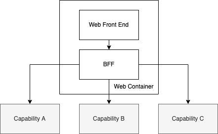
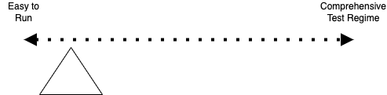
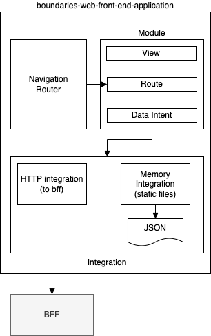
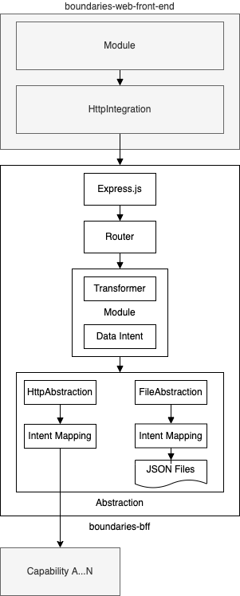

# Boundaries

Well bounded systems tend to be comprised of simpler components which encapsulate their functionality inside their boundaries.

Access to those capabilities is presented as an interface, below which the implementation detail is hidden behind the encapsulation boundary.

As systems get simpler, there tend to be fewer moving parts which in turn requires less overhead in testing, and allows for systems to be composed of different implementations as the operating context changes.

When we design systems to those boundary contexts, the resulting system will eliminate interdependency, coupling, and complexity, making the operational characteristics simpler, the ongoing maintainance and ownership cheaper, and the developer experience better by being simpler to run.

This repository contains an implementation of a simple react-based web front end, and a backend for that frontend (bff). It is a demonstration of separation of concerns to facilitate an easy-to-run, modular set of components which together form a logical container, and abstract away implementation detail at each boundary. 

In particular the web and bff components are designed to be independent, with mechanisms for running each component to operate with static data or through an http connection to the underlying implementation - a pattern repeated in both the web and bff components.

The patterns in use here and the underlying software design intent comes from a past life building software elswhere, and the skeleton code came from some early spike work i had archived, and while it did form the foundations for that work, it also evolved and matured over time, and what is presented here represents the essential early design and functioning implementation.   

## Software Design

All designs trade off pros and cons for benefits over cost or consequence, and the design of the system here is unashamedly biased toward simplicity to run, as both a developer experience and expedience choice. This choice comes with the benefit that change in each component can be quick and easily verified locally, and comes at the cost of needing to enforce patterns and practices with eternal vigillence.

This approach is made possible by some underlying design principles for the system as a whole:
- the web front end should be 'dumb' and really provide a presentation layer, and plumbing to get data, and render it
- the web front end _only_ calls the bff directly, for every request.
- data is only made available through the defined integration layer - components cannot directly call for data through any other means.
- each 'screen' in the web front end is supported by a dedicated endpoint in the BFF which stitches together and transforms responses to be immediately consumable by the web front end
- the bff is a dedicated component of the web container, whose sole responsibility it is to abstract away the implementation detail of underlying capabilities (backend services)

These design principles lead to an outcome where we clearly delineate the responsibilities at different layers in both the web and bff, and provides boundaries as 'seams' which allow us to switch integration mechanisms for different environments.

This allows us to develop a user interface without needing any http interaction from a running bff, or the need to use automocking frameworks to stub and proxy request/response loops, which in turn separates _our_ code from libraries in terms of what to test. The same principle is applied in the bff, such that the extraction and transformation responsibilities can be built and asserted without the need for external running test/development environments. 

Without the noise of http and mocking, we can easily assert the behaviour of _our_ code in the good, bad, and ugly cases - so our tests get simpler, and there are fewer of them. 

By making it easy to run locally with different configurations, and through well bounded internal contexts for integration or presentation, development, delivery, and quality all improve.

### software design - web
The purpose here is not a pretty website but rather a demonstration of how to separate concerns through boundaries, and as such the 'views' are bare minimum functional components.

It is a simple react single page application, using a common router library to map window locaton paths to different views which are populated with data provied through a runtime-selected integration mechamism.

As this is a react app, some local plumbing is necessary to manage state in the views and is provided as needed.

On startup, the application wires up a navigation router, plugging in each module to a navigable route, and provides a handle to the runtime selected integration - either the HttpIntegration (which uses http to integrate with a configurable BFF endpoint), _OR_ the MemoryIntegration, which uses the static data provided in json files in the data directory.

The runtime configuration selection of the integration is via environment variables, exposed through a Config object, which are set through files in the `public/` directory as config-env.json files. 

As the presentation layer is expecting data ready for consumption, modules provide data intents to the integration, which collects data, and feeds it into the render to populate the presentation layer in the view.

This integration mechanism provides both read and write functions, with mappings between the module specific data intent and the integration specific handlers.

For the HttpIntegration, a running bff is expected to be running on the configured url. The MemoryIntegraton uses static/canned data found in the `integration/memoryMapping/data/` directory

The design intent here is to ensure the module responsibilities are separated from the integration mechanism. this in turn allows the development of the user interface to take place with sample data and simple setup and run operation. validating that against a running BFF is similarly simple to run. 

Implicit in this design is the separation of concerns should lead developers to consider tests in terms of how the module code behaves, and to build trust in the integration mechanism through regular local deployment. This should in turn lead to simpler testing strategies which assert the expected behaviour of the code in specific conditions rather than asserting the correctness of expected outputs. 

You could still go ahead and build automated, stateful, click through tests here with selenium or the like, but i wouldnt - i'd just run things locally when i'm building and changing things. 

### software design - bff
Like the web above, the BFF is intended to demonstrate separation of concerns through boundaries of responsibilities, and is presented with minimal capabilities beyond what is needed for that demonstration. Some vestigial authentication hooks are here, but are provided as reference for where auth mechanisms can be inserted, and are not implmented here.

The responsibility of the BFF is to be a logical component of the web front end, which happens to run as a server side or backend service. Its job is to fetch, transform, and stitch together data from underlying data sources and capabilities such that the caller (the web front end) does not need to do anything more than consume and present it - or collect and pass it down for persistence of other action.

The only client of a bff is the specific front end it has been built for, and in this case it is the bundled web application above.

Taking similar boundary cues from the software design of the web application above, the bff is a modular design with clear boundaries of responsibility within its layers, and provides similar integration abstractions for fetching remote data as the web application does.

This gives the developer a simple to run development experience that allows for a test driven approach to the core responsibilities - namely the collation and transformation of data from source systems - without needing to orchestrate external environments. This approach again leads the developer to assert the behaviour of the component during test rather than the correctness of output for arbitrary underlying data, though this can also be asserted. As with the web front end, the tendency toward fewer tests is expected, as much of the code per module is little more than boilerplate.

On startup, express.js is configured to route requests to module(s) which are in turn provided with the relevant integration abstraction (Http or Memory) as per environment configuration. 

Modules are self contained units which collect data through the provided integration abstraction and apply a transformer to data collected and returns the payload specific to the requested route/path

Data intents again direct the integration for what is requested, and abstraction mapping provides implementation of File and Http abstraction with context to complete data requests. read and write operations are catered for.

File abstraction again provides static data in json files in the source tree, which are representative of the payload contracts expected of any external capability, and can be served directly as static responses to requests from the running web front end, and more directly during development to assert transformer behaviour and output.

Http abstraction integrates with external (to this system) capabilities to fetch and update data through those interfaces. 

Data intents are mapped per module, per abstraction and provide implementation detail relevant to each context.

On receipt of the data intent request(s) the module transformer is applied and the result is returned to the caller
